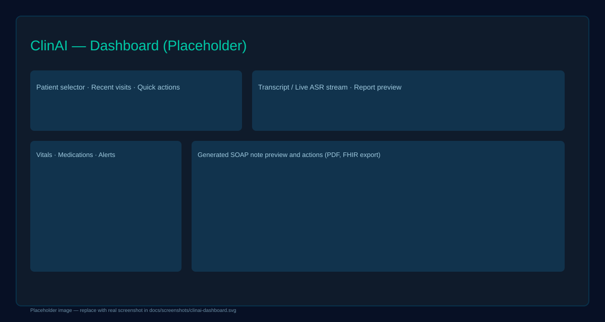

# ClinAI

ClinAI is a full-stack clinical documentation assistant that converts physician-patient conversations into structured medical reports, FHIR resources, and HIPAA-ready clinical summaries.

Built with a React frontend and a Python FastAPI backend, ClinAI combines speech-to-text, retrieval-augmented generation, and FHIR interoperability for a polished clinical workflow.

## Key Highlights

- **Voice-driven clinical documentation** with automatic speech recognition (ASR)
- **Smart clinical report generation** powered by retrieval-augmented generation (RAG)
- **FHIR R4 EHR integration** for Patient, Encounter, Observation, Condition, and MedicationRequest resources
- **HIPAA-aware middleware** with encryption, audit logging, and secure transport patterns
- **Modern React UI** with patient selection, report generation, and PDF export support
- **Extensible backend architecture** with modular routers for ASR, RAG, report generation, and FHIR

## What Makes ClinAI Impressive

- Supports multiple ASR providers, including OpenAI Whisper and Deepgram Medical
- Uses a vector database and embeddings for clinical knowledge retrieval
- Generates structured SOAP notes, discharge summaries, and referral letters
- Prepares data for real-world EHR systems such as Epic, Cerner, and SMART-on-FHIR endpoints
- Includes robust development tooling and API documentation via FastAPI

## Architecture Overview

- `frontend/` — React application for patient selection, audio workflow, and document preview
- `backend/` — FastAPI service with modular routers and middleware
- `backend/main.py` — central API entrypoint with CORS, logging, and router discovery
- `backend/requirements.txt` — Python dependencies for ASR, embeddings, FHIR, security, and observability
- `ClinAI-Architecture-README.md` — architecture diagram and design details

## Tech Stack

- Frontend: `React`, `react-scripts`
- Backend: `FastAPI`, `Uvicorn`
- ASR: `OpenAI Whisper`, `Deepgram Nova-2-Medical`
- RAG / Embeddings: `Pinecone`, `tiktoken`
- FHIR: `fhir.resources`
- Security: `cryptography`, `python-jose`, `passlib`, `pyotp`
- Observability: `structlog`, `prometheus-fastapi-instrumentator`

## Live Demo / User Flow

1. Launch the backend API
2. Open the React app
3. Select or register a patient
4. Start speech recognition or upload conversation text
5. Generate a clinical report
6. Export a polished PDF or convert findings into FHIR resources

## Setup Instructions

### 1. Backend

```bash
cd backend
python -m venv .venv
# Windows
.\.venv\Scripts\activate
# macOS / Linux
# source .venv/bin/activate
pip install -r requirements.txt
```

Create a `.env` file in `backend/` with required API keys and configuration. Example values:

```env
OPENAI_API_KEY=your_openai_api_key
DEEPGRAM_API_KEY=your_deepgram_api_key
PINECONE_API_KEY=your_pinecone_api_key
PINECONE_ENVIRONMENT=your_pinecone_env
CLAUDE_API_KEY=your_claude_api_key
APP_PORT=8000
```

Start the backend:

```bash
cd backend
python main.py
```

Open the API docs at: `http://localhost:8000/api/docs`

### 2. Frontend

```bash
cd frontend
npm install
npm start
```

Open the browser at: `http://localhost:3000`

The frontend is configured to proxy API requests to `http://localhost:8000`.

## Project Structure

```text
├── ClinAI-Architecture-README.md  # architecture and design notes
├── backend/
│   ├── main.py                    # FastAPI entrypoint
│   ├── requirements.txt           # Python dependencies
│   ├── middleware/                # HIPAA and security middleware
│   ├── routers/                   # modular API routes
│   └── database.py                # data persistence support
├── frontend/
│   ├── package.json               # React app configuration
│   ├── public/                    # static web assets
│   └── src/                       # React UI components
├── requirements.txt               # global Python dependency list
└── README.md                      # project overview
```

## Notes for Recruiters

- Designed to showcase end-to-end product thinking: UI, backend, AI integration, and compliance.
- Built for practical adoption in healthcare environments with FHIR compatibility and audit-ready behavior.
- Demonstrates experience with modern full-stack development, API design, machine learning integration, and clinical domain awareness.

## Next Improvements

- Add real speaker diarization for physician/patient turn detection
- Connect to a production-grade FHIR server with OAuth2 SMART-on-FHIR workflows
- Include a managed database backend and deployment scripts
- Add automated tests for API endpoints and React flows

## Badges

[](https://www.python.org/)
[](https://reactjs.org/)
[](#)
[](http://localhost:8000/api/docs)

## Screenshots

Add visual assets to `docs/screenshots/` and they will appear here. Example image files to add:

- `docs/screenshots/clinai-dashboard.svg` — primary app dashboard
- `docs/screenshots/clinai-report-preview.svg` — generated SOAP note preview



If you prefer, I can generate placeholder images and add them to the repo.

## API Examples

Simple `curl` example: generate a report from a transcript

```bash
curl -X POST http://localhost:8000/api/report/generate \
	-H "Content-Type: application/json" \
	-d '{
		"session_id": "demo-123",
		"transcript": [{"speaker":"Doctor","text":"Hello"},{"speaker":"Patient","text":"Hi"}],
		"report_type": "soap",
		"use_rag": false
	}'
```

Python `requests` example:

```python
import requests

url = "http://localhost:8000/api/report/generate"
payload = {
		"session_id": "demo-123",
		"transcript": [{"speaker":"Doctor","text":"Hello"},{"speaker":"Patient","text":"Hi"}],
		"report_type": "soap",
		"use_rag": False
}
resp = requests.post(url, json=payload)
print(resp.status_code)
print(resp.text)
```

## Showcase Tips (for recruiters)

- Record a 2–4 minute demo consultation and show the generated SOAP note and PDF export.
- Highlight FHIR export (Bundle) and mention HIPAA middleware and encryption during the demo.
- Point to `backend/main.py` for the API routing and `frontend/src/ClinAI.jsx` for the UX flow.

## Contributing & Contact

- To contribute, fork the repo, create a branch, and open a pull request describing your change.
- For interview/demo requests or questions, email: yourname@example.com (replace before publishing).

## License

This repository is intended for demonstration and interview use. Please add a license if you publish it publicly.
